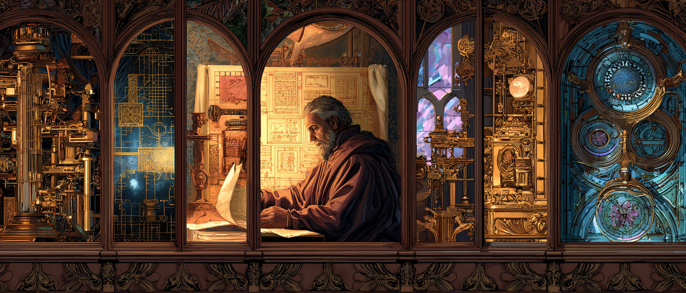

<p align="center">
  
</p>

<h1 align="center">Night Mode for Claude Code</h1>

<p align="center">
  <strong>Autonomous overnight worker skill for <a href="https://docs.anthropic.com/en/docs/claude-code">Claude Code</a></strong><br/>
  Leave your computer at night. Come back to finished work in the morning.
</p>

<p align="center">
  
  
  
</p>

---

<p align="center">
  
</p>

## How it works

You describe the task. Claude asks 10 precise questions. You answer, go to sleep. Claude works through the night — implementing, testing, fixing, committing — and leaves you a summary in the morning.

<p align="center">
  
</p>

### The 4 Phases

| Phase | What happens |
|:---:|---|
| **Discovery** | Claude asks 10 targeted questions — goal, scope, tech stack, tests, constraints |
| **Planning** | Breaks the task into small, trackable steps |
| **Execution** | Autonomous work loop: implement → test → fix → commit → repeat |
| **Verification** | Full test suite, build, linting, summary report |

---

## Quick start

### Option 1: Interactive

```
/night-mode
```

Run inside Claude Code CLI. Claude asks 10 questions, then works autonomously.

### Option 2: Background script (recommended for overnight)

```bash
./night-mode.sh "Implement JWT authentication system"
```

The script:
- Asks 10 questions in the terminal — you answer before bed
- Launches Claude in the background with `--dangerously-skip-permissions`
- Logs everything to `logs/night-mode/`
- Keeps running after you close the terminal

### Check status in the morning

```bash
./night-status.sh
```

Or read `NIGHT_MODE_SUMMARY.md` for the full report.

---

## What Claude does overnight

- Reads and understands existing code before making changes
- Implements features step by step
- Runs tests after every change
- Auto-fixes failing tests (up to 3 attempts per problem)
- Commits after every meaningful change
- Documents blockers it couldn't resolve
- Writes a detailed summary when done

## Safety

- Never pushes to remote (unless explicitly allowed)
- Never deletes important files
- Never modifies `.env` or secrets
- Stops and documents problems after 3 failed attempts
- Stays within the defined scope — no rogue refactoring

## Output files

| File | Description |
|------|-------------|
| `NIGHT_MODE_SUMMARY.md` | What was done, what wasn't, how to verify |
| `NIGHT_MODE_BLOCKERS.md` | Unresolved problems encountered |
| `logs/night-mode/` | Full session logs |

---

## Installation

Copy these files into your project:

```
your-project/
  .claude/
    commands/
      night-mode.md    # The skill prompt
  night-mode.sh        # Background launcher
  night-status.sh      # Status checker
```

Then use `/night-mode` in Claude Code or run `./night-mode.sh "your task"`.

## Requirements

- [Claude Code CLI](https://docs.anthropic.com/en/docs/claude-code) installed
- Bash (Git Bash on Windows works)

---

<p align="center">
  
</p>

<p align="center">
  <sub>Go to sleep. Wake up to commits.</sub>
</p>

## License

MIT
